# Cloud Computing Lab Notes

This repository is a visual lab journal for introductory cloud computing,
virtualization, virtual networking, and software-defined networking exercises.
The screenshots show the setup of Ubuntu virtual machines in Oracle
VirtualBox, configuration of a shared NAT network, connectivity validation
between guests, and Mininet topology creation.

The material is organized chronologically into three lab days:

- **Day 1:** Create and boot an Ubuntu virtual machine.
- **Day 2:** Clone/configure virtual machines and verify guest-to-guest networking.
- **Day 3:** Create common Mininet network topologies.

> This is an image-based record. There are no scripts or source files in the
> repository; the commands and settings below are transcribed from the
> screenshots.

## Contents

- [Lab Outcomes](#lab-outcomes)
- [Tools and Environment](#tools-and-environment)
- [Repository Layout](#repository-layout)
- [Day 1: Ubuntu VM Creation](#day-1-ubuntu-vm-creation)
- [Day 2: VM Networking](#day-2-vm-networking)
- [Day 3: Mininet Topologies](#day-3-mininet-topologies)
- [Networking Concepts Demonstrated](#networking-concepts-demonstrated)
- [Reproducing the Lab](#reproducing-the-lab)
- [Important Notes](#important-notes)

## Lab Outcomes

By the end of the recorded exercises, the lab demonstrates:

1. Creating an Ubuntu 25.04 64-bit virtual machine from an ISO image.
2. Allocating virtual hardware and a dynamically sized virtual disk.
3. Completing an unattended Ubuntu installation in VirtualBox.
4. Booting Ubuntu successfully and reaching the desktop.
5. Running two Ubuntu guests at the same time.
6. Connecting guests to the same VirtualBox NAT Network.
7. Confirming communication with `ping` and observing zero packet loss.
8. Creating linear, reversed, tree, and single-switch Mininet topologies.

## Tools and Environment

The screenshots visibly reference the following tools and values:

- **Host virtualization platform:** Oracle VirtualBox
- **Guest operating system:** Ubuntu Linux, 64-bit
- **Installation image:** `/home/abhishek/Downloads/ubuntu-26.04-desktop-amd64.iso`
- **Example VM name:** `abhishekkk`
- **Virtual disk format:** VDI (VirtualBox Disk Image)
- **Example memory allocation:** 2048 MB
- **Example virtual disk size:** 25.00 GB
- **Virtual network:** `NatNetwork`
- **IPv4 network:** `10.0.2.0/24`
- **DHCP:** Enabled
- **Network emulation tool:** Mininet
- **Switch backend shown by Mininet:** OVS Bridge fallback

The ISO filename shown in the screenshot uses a future-looking version number.
Use the Ubuntu ISO that is actually available in your environment rather than
copying that filename literally.

## Repository Layout

```text
.
├── day-1/
│   ├── 1.png ... 7.png
├── day-2/
│   ├── 1.png, 2.png, 3.png
│   ├── 4.1.png, 4.2.png, 4.3.png
│   └── 6.png
├── day-3/
│   ├── linear.png
│   ├── reversed.png
│   ├── single.png
│   └── tree.png
└── README.md
```

## Day 1: Ubuntu VM Creation

Day 1 captures the VirtualBox **New Virtual Machine** wizard from initial
identity and operating-system selection through hardware and storage setup.

### Step 1: Identify the VM and ISO

The first screenshot shows:

- VM name: `abhishekkk`
- VM folder: `/home/abhishek/VirtualBox VMs`
- Linux guest operating system
- Ubuntu distribution
- 64-bit architecture
- Unattended installation enabled

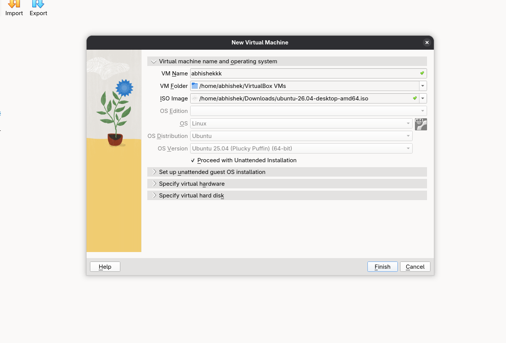

### Step 2: Configure unattended installation

The unattended-installation panel contains a guest username, a masked
password, host name `abhishekkk`, and domain name `myguest.virtualbox.org`.
The screenshot also shows the optional Guest Additions controls.

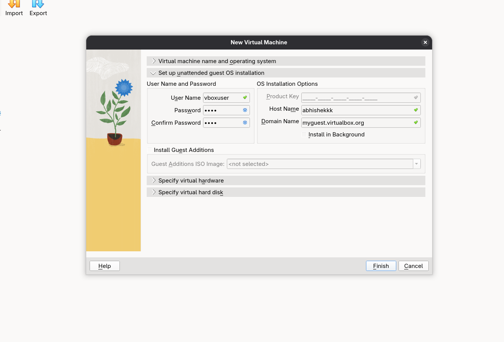

### Step 3: Allocate virtual hardware

The hardware panel allocates:

- **Base memory:** 2048 MB
- **Processors:** 1 CPU
- **EFI:** Not selected in the screenshot

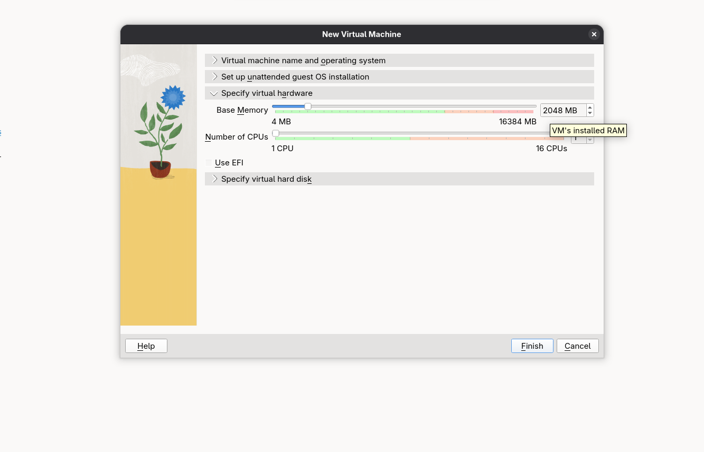

### Step 4: Create the virtual hard disk

The storage panel shows a new VDI disk with:

- A disk path under `/home/abhishek/VirtualBox VMs/abhishekkk/`
- Size: 25.00 GB
- Format: VDI
- Full-size pre-allocation: Not selected

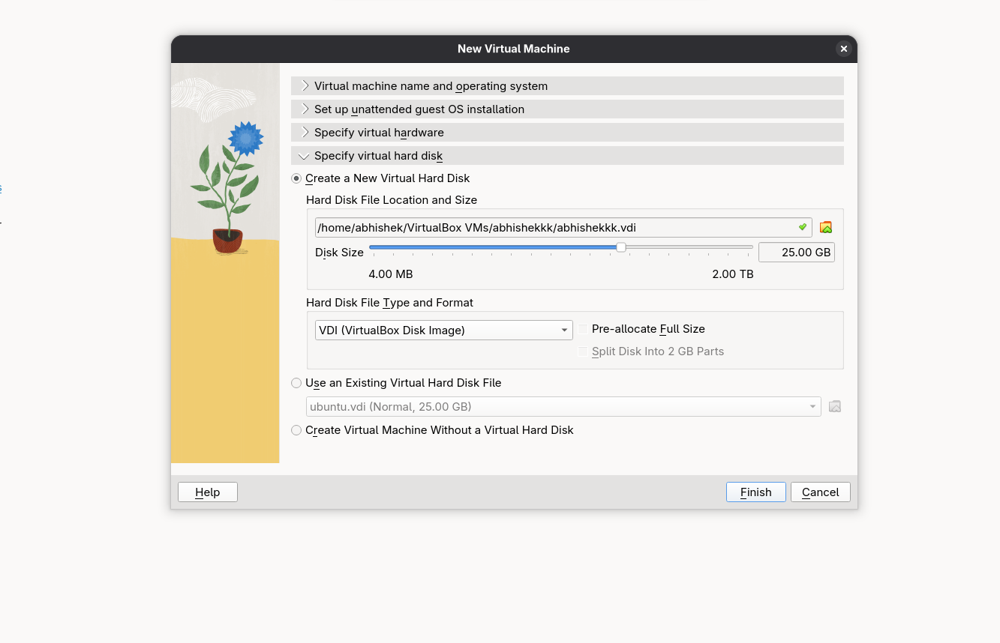

### Step 5: Observe the first boot

The VM console shows Ubuntu services starting successfully, including
`cloud-init`, `systemd`, Snap services, the display manager, and the user
session. This confirms that the guest has progressed through boot rather than
stopping at an early initialization error.

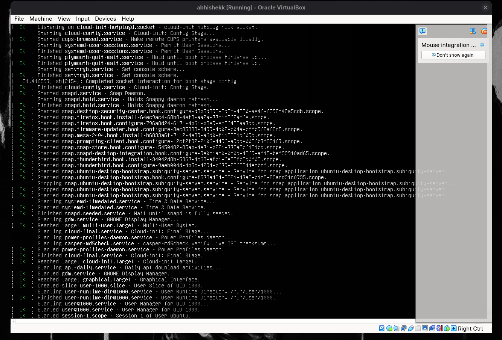

### Step 6: Reach the Ubuntu desktop

The next screenshot shows the Ubuntu desktop inside the running VirtualBox
window. The VM has successfully completed startup and is ready for use.

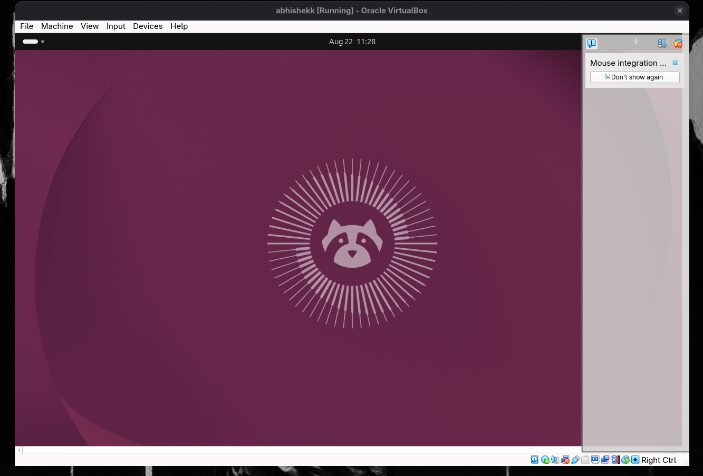

### Step 7: Inspect VM resource usage

VirtualBox Resource Use displays CPU, network, and disk activity for the
running Ubuntu VM. The RAM chart is unavailable because Guest Additions are
not installed, which is explicitly shown in the interface.


## Day 2: VM Networking

Day 2 moves from a single guest to multiple Ubuntu guests. The screenshots
show cloned/running VMs, VirtualBox NAT Network configuration, and successful
ICMP connectivity tests.

### Step 1: Run two Ubuntu guests

The VirtualBox windows show two guests reaching the Ubuntu login screen. Both
guests expose the `vboxuser` account, indicating that the machines are ready
for independent login and network testing.

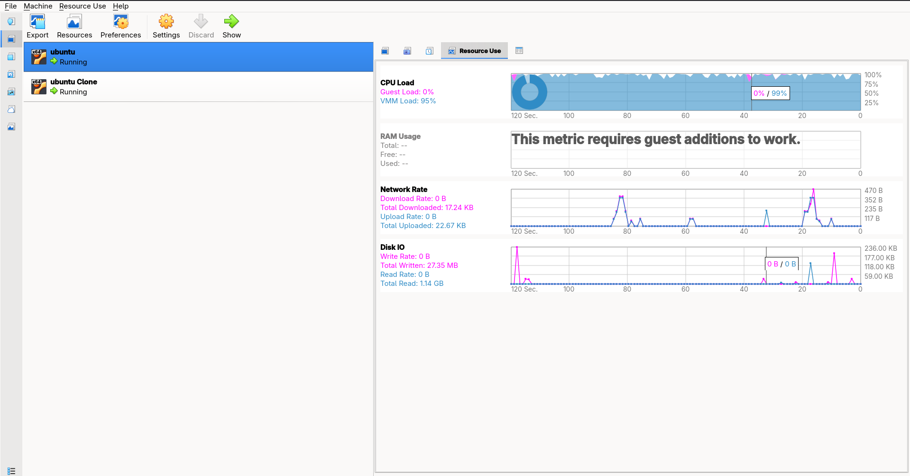

### Step 2: Verify connectivity with ping

The terminals show each guest inspecting its `enp0s3` interface and testing
the other guest with `ping`:

- One guest uses address `10.0.2.4` and pings `10.0.2.4` from the peer context.
- The other guest uses address `10.0.2.15` and pings `10.0.2.15` from the peer context.
- The displayed tests complete with **0% packet loss**.

The screenshots also show Ethernet interfaces in the `UP` state and IPv4
addresses in the `10.0.2.0/24` network.

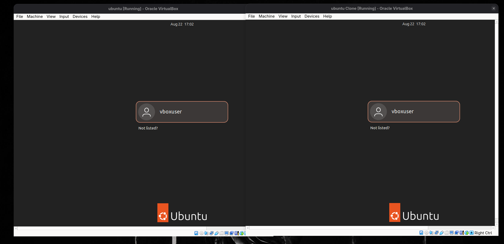

### Step 3: Configure the first NAT Network adapter

The VirtualBox settings panel shows the network adapter attached to:

- **Attachment:** NAT Network
- **Network name:** `NatNetwork`
- **Adapter type:** Intel PRO/1000 MT Desktop (82540EM)
- **Promiscuous mode:** Deny
- **Virtual cable:** Connected

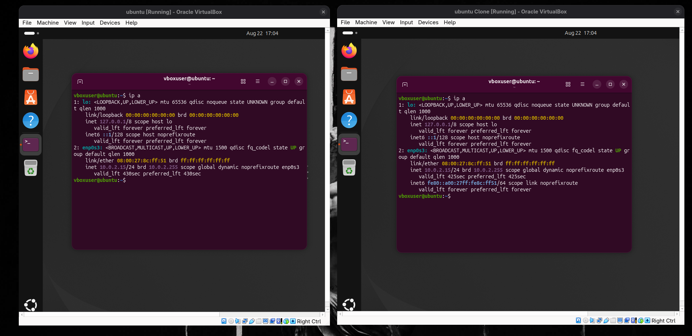

### Step 4: Configure the second NAT Network adapter

The second VM uses the same `NatNetwork` attachment and the same adapter
family. Its separate MAC address allows VirtualBox to treat it as a distinct
network interface while placing it on the shared virtual network.

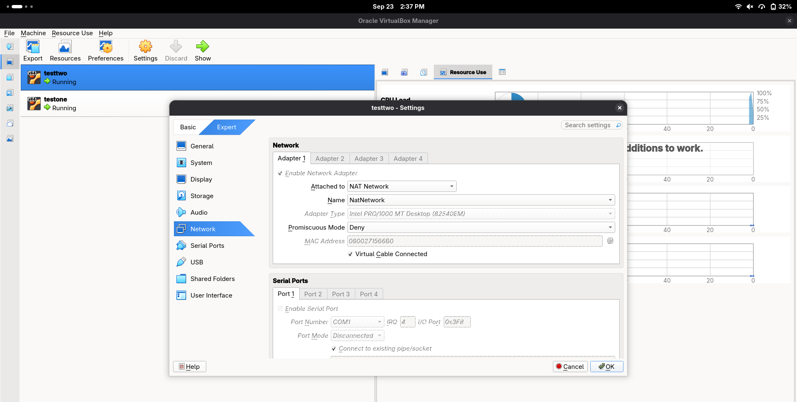

### Step 5: Inspect NAT Network addressing and DHCP

The VirtualBox Network Manager shows:

- Network name: `NatNetwork`
- IPv4 prefix: `10.0.2.0/24`
- DHCP server: Enabled

This configuration explains how both guests receive addresses from the same
virtual subnet and can communicate directly.

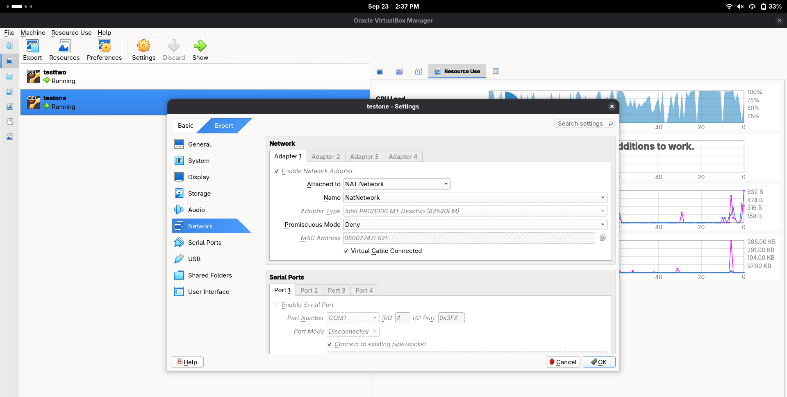

### Step 6: Reconfirm guest-to-guest reachability

The final Day 2 connectivity screenshot shows both Ubuntu terminals pinging
`10.0.2.15`. Every visible reply is received, and the ping summaries report
zero packet loss with sub-millisecond round-trip times.

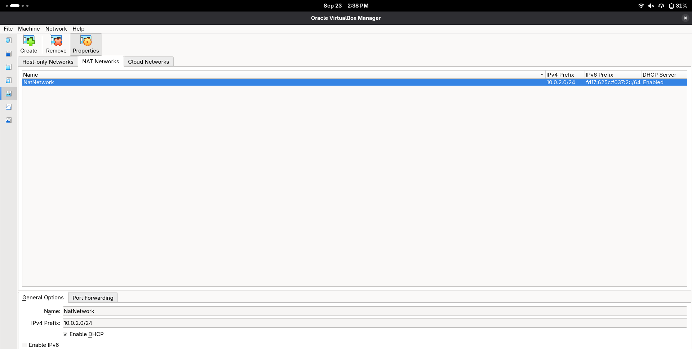

### Additional Mininet capture

The Day 2 image below begins the Mininet portion of the exercises. It shows a
linear topology with three hosts and three switches being created.

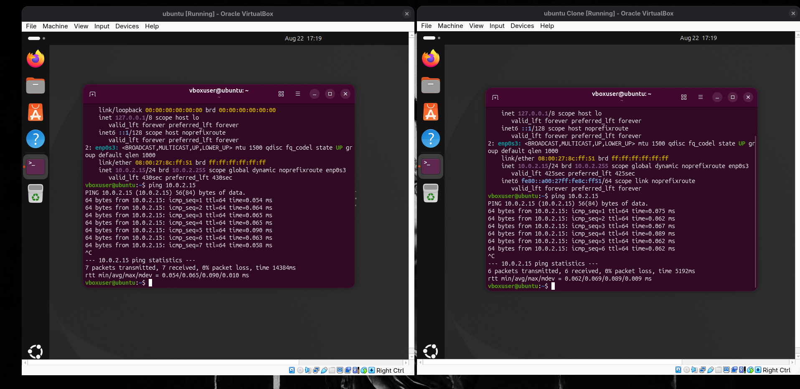

## Day 3: Mininet Topologies

The Mininet screenshots use the interactive CLI and the `links` command to
verify that the expected host-switch and switch-switch links were created.
Mininet reports that no default OpenFlow controller was found and falls back
to an OVS bridge, which is sufficient for this topology inspection exercise.

### Linear topology

The linear topology creates three hosts and three switches arranged in a
chain. The visible links follow this pattern:

```text
h1 -- s1 -- s2 -- s3 -- h3
             |
             h2
```

The exact interface names and ordering are visible in the CLI output.

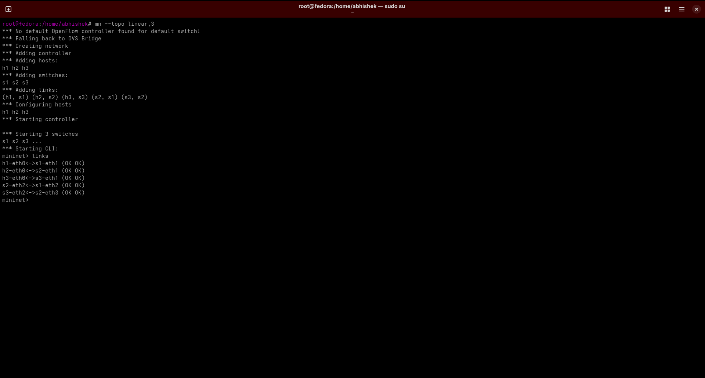

### Reversed topology

The reversed topology connects three hosts to one switch. The visible output
shows the host-side interfaces attached in reverse order, demonstrating that
topology construction can change link orientation and interface numbering
without changing the number of hosts or switches.

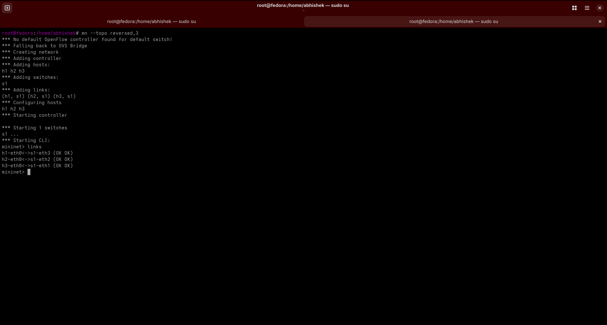

### Tree topology

The tree topology expands to multiple switch levels. The screenshot shows
hosts `h1` through `h8`, switches `s1` through `s7`, and links connecting the
hierarchical branches. This is useful for studying fan-out and multi-level
forwarding paths.

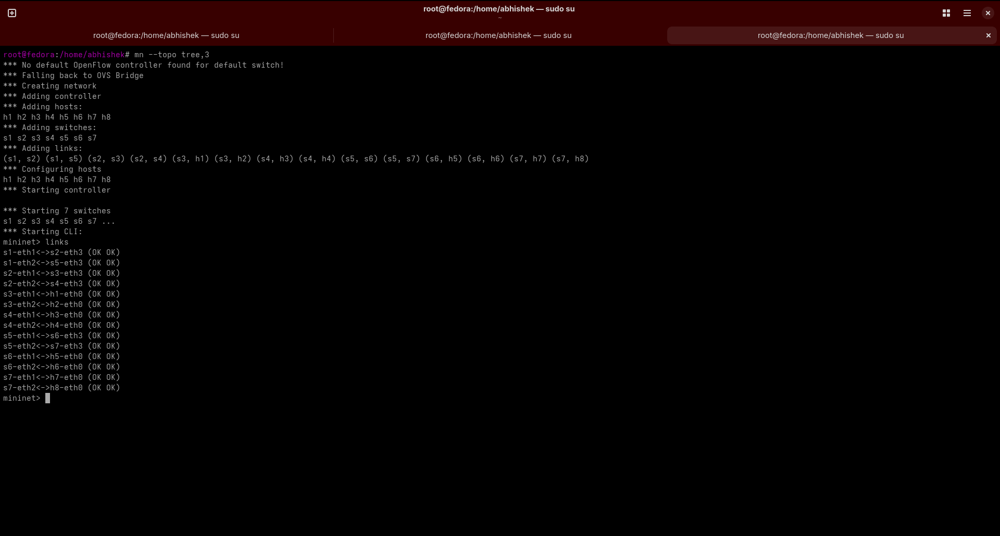

### Single-switch topology

The single topology attaches three hosts to one switch:

```text
h1 -- s1
h2 -- s1
h3 -- s1
```

This is the smallest topology in the collection and provides a baseline for
understanding host-to-switch connectivity before moving to multi-switch
networks.

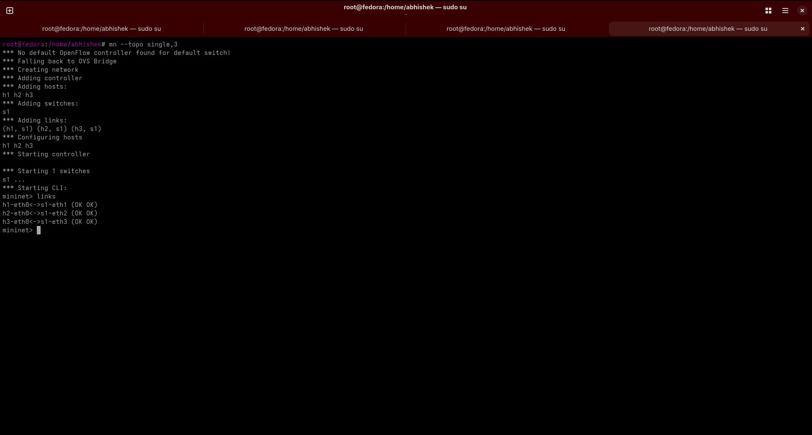

## Networking Concepts Demonstrated

### Virtual machines

A virtual machine provides an isolated guest operating system backed by host
resources. The Day 1 settings show the main resources exposed to the guest:
memory, CPU, disk, virtual network adapter, and optional EFI/Guest Additions
features.

### NAT Network versus ordinary NAT

VirtualBox NAT normally provides outbound access for a guest. A **NAT
Network** additionally places multiple guests on a shared private virtual
network, allowing them to communicate through addresses assigned from the
same subnet. In this lab, that subnet is `10.0.2.0/24`.

### DHCP

DHCP is enabled for `NatNetwork`, so guests can automatically receive IPv4
configuration. The screenshots show addresses such as `10.0.2.4` and
`10.0.2.15` being used for connectivity tests.

### ICMP and ping

`ping` sends ICMP echo requests and waits for echo replies. A result of 0%
packet loss indicates that all requests shown in the capture received replies.
The reported round-trip time provides a basic latency check, not a complete
performance benchmark.

### Mininet

Mininet creates lightweight software-defined networks using hosts, switches,
links, and optionally controllers. The `links` command is a quick validation
step because it exposes the interfaces and connection state for every link.

## Reproducing the Lab

### VirtualBox setup

1. Install Oracle VirtualBox on the host machine.
2. Download an Ubuntu 64-bit desktop ISO.
3. Create a new Linux/Ubuntu virtual machine.
4. Allocate approximately 2 GB RAM, 1 CPU, and a 25 GB VDI disk, adjusting
   values for the host machine.
5. Complete the installation and boot the guest.
6. Create a second guest by cloning the first or repeating the installation.
7. Open **VirtualBox > Tools > Network Manager > NAT Networks**.
8. Create or select `NatNetwork` with IPv4 prefix `10.0.2.0/24` and DHCP
   enabled.
9. Attach the first adapter of each guest to the same NAT Network.
10. Start both guests and run `ip addr` or `ip a` to identify their addresses.
11. Run `ping <peer-ip>` from each guest and confirm the replies.

### Mininet setup

On a Linux system with Mininet installed, the screenshots use commands in this
family:

```bash
sudo mn --topo single,3
sudo mn --topo linear,3
sudo mn --topo reversed,3
sudo mn --topo tree,3
```

Inside the Mininet CLI, inspect the generated connections with:

```text
mininet> links
```

Exit the CLI with `exit` or press `Ctrl-D`.

## Important Notes

- The screenshots contain local usernames, host paths, MAC addresses, private
  IP addresses, VM names, timestamps, and masked password fields. Review them
  before publishing the repository publicly.
- The image filenames are useful for organization but should not be treated as
  authoritative metadata. At least one Mininet screenshot visibly contains a
  topology command whose name does not clearly match the file name. The
  README therefore describes the visible command/output and preserves every
  original image link.
- The displayed `0% packet loss` results prove reachability for the captured
  moment only. They do not prove persistent availability, throughput, or
  security isolation.
- Resource graphs are observations from one VirtualBox session and should not
  be used as production capacity measurements.

## Image Index

All images in the repository are embedded above. The direct links are also
listed here for quick navigation:

### Day 1

- [day-1/1.png](day-1/1.png)
- [day-1/2.png](day-1/2.png)
- [day-1/3.png](day-1/3.png)
- [day-1/4.png](day-1/4.png)
- [day-1/5.png](day-1/5.png)
- [day-1/6.png](day-1/6.png)
- [day-1/7.png](day-1/7.png)

### Day 2

- [day-2/1.png](day-2/1.png)
- [day-2/2.png](day-2/2.png)
- [day-2/3.png](day-2/3.png)
- [day-2/4.1.png](day-2/4.1.png)
- [day-2/4.2.png](day-2/4.2.png)
- [day-2/4.3.png](day-2/4.3.png)
- [day-2/6.png](day-2/6.png)

### Day 3

- [day-3/linear.png](day-3/linear.png)
- [day-3/reversed.png](day-3/reversed.png)
- [day-3/tree.png](day-3/tree.png)
- [day-3/single.png](day-3/single.png)